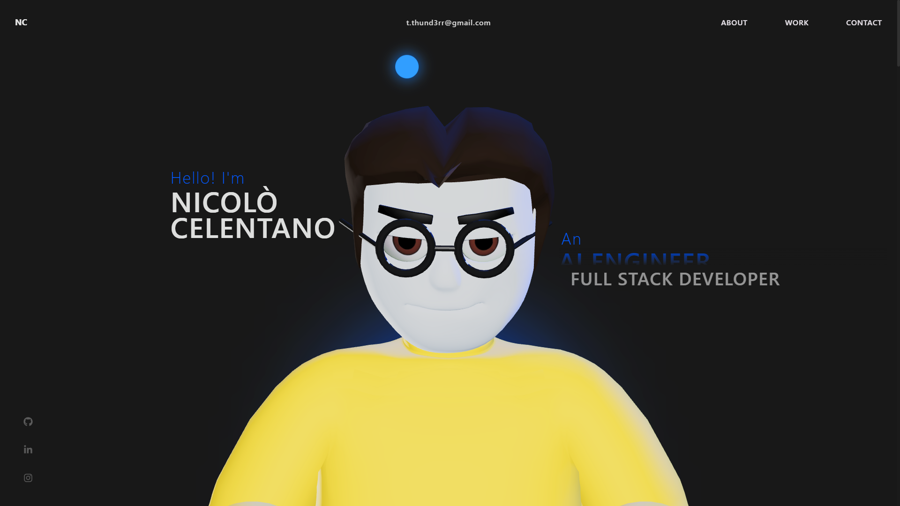
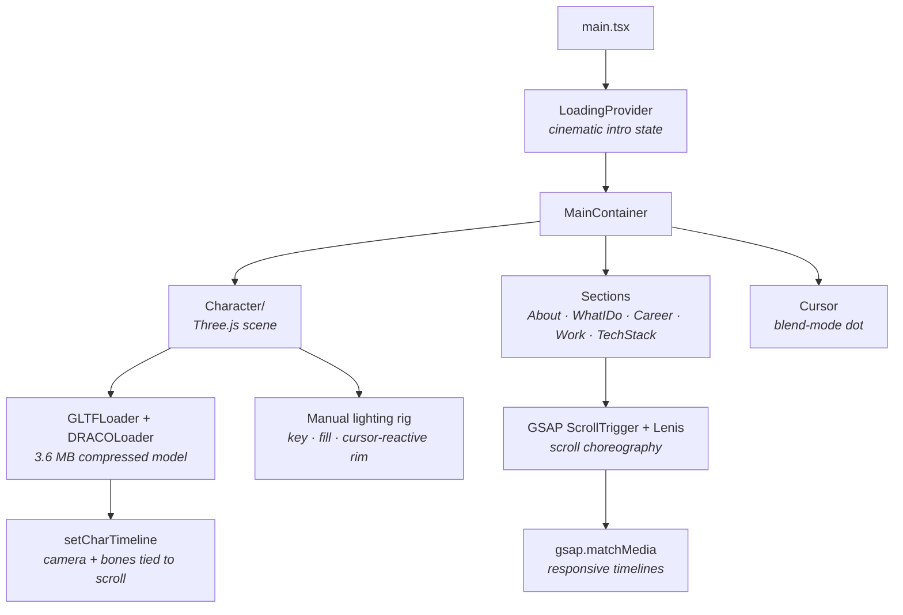

<div align="center">

# Nicolò Celentano — Portfolio

**An interactive 3D portfolio built from scratch.**
Real-time WebGL character · scroll-driven storytelling · 92% asset compression

[](https://react.dev)
[](https://www.typescriptlang.org)
[](https://threejs.org)
[](https://gsap.com)
[](https://vite.dev)
[](https://portfolio-gray-three-12.vercel.app/)

### [▶ &nbsp;View it live](https://portfolio-gray-three-12.vercel.app/)



</div>

---

## The experience

A single-page journey through six scroll-driven scenes. The 3D character is the thread: it watches your cursor on the landing, turns to its desk while you read the About section, then scrolls away as the work takes over.

| Scene | What happens |
|---|---|
| **Landing** | Custom 3D character rendered in WebGL. The head tracks your cursor via bone rotation; a blue rim light breathes behind it |
| **About** | Camera pulls back, the character turns to a desk that fades in — monitor flicker included. Text reveals per-character |
| **What I Do** | Service cards expand on hover (tap on touch devices), heading sits sticky beside them |
| **Career** | Timeline scrubbed by scroll — the line grows, entries slide in, progress bars fill |
| **Selected Work** | Section pins while a horizontal track translates through six projects. Click any card for screenshots and the full story |
| **Tech Stack** | A periodic table of tools. Elements illuminate on hover |

---

## How it works



**One config file drives all content.** Career entries, projects, the tech stack — everything lives in [`src/config.ts`](src/config.ts). Components are pure presentation.

---

## Technical deep dives

### 🗜 47 MB of geometry in a 3.6 MB file

The character is a custom Blender model — 946K vertices, fully rigged, 11 skeletal animations. Draco compression shrinks it **48.7 MB → 3.6 MB (−92%)** with no visual loss. The decoder is self-hosted so there's no third-party CDN dependency:

```ts
const dracoLoader = new DRACOLoader();
dracoLoader.setDecoderPath("/draco/");
const loader = new GLTFLoader();
loader.setDRACOLoader(dracoLoader);
```

Compression must preserve node names — the scroll animations grab bones like `spine005` by name at runtime.

### 👀 The head that follows you

No pre-baked animation: the head bone rotates toward the cursor every frame, smoothed with lerp so it feels organic rather than mechanical:

```ts
const targetY = mouseX * 0.28;
const targetX = -mouseY * 0.18;
headBone.rotation.y = lerp(interpX, targetY, 0.06);
headBone.rotation.x = lerp(interpY, targetX, 0.06);
```

Touch devices get the same behavior through `touchmove`, easing back to center on release.

### 📐 Animations that survive any viewport

Every breakpoint-dependent timeline is registered through `gsap.matchMedia()`, so GSAP builds and reverts them automatically when the viewport crosses a breakpoint — resize the window, rotate a tablet, toggle DevTools device mode: the choreography adapts live, no reload needed.

```ts
const mm = gsap.matchMedia();
mm.add("(min-width: 769px)", () => {
  // horizontal pin exists only on desktop —
  // reverted automatically below 768px
  const tl = gsap.timeline({
    scrollTrigger: { trigger: ".work-section", pin: true, scrub: 1, ... },
  });
  tl.to(track, { x: () => -getTranslateX(), ease: "none" });
});
```

### 🎬 The loading sequence

A white screen with a scrolling marquee and a black progress pill. When assets are ready, the pill expands to swallow the viewport, then the whole overlay collapses to reveal the scene. State flows through a React context so every component knows when the intro has finished — text reveals and the character's intro animation wait for it.

### ⚡ Performance budget

| Asset | Before | After | How |
|---|---|---|---|
| 3D model | 48.7 MB | **3.6 MB** | Draco compression |
| Background video | 21.6 MB | **3.4 MB** | 720p H.264 re-encode |
| Screenshots & logos | 4.6 MB | **0.5 MB** | WebP conversion |
| **Total payload** | **~72 MB** | **~8 MB** | **−89%** |

Plus: lazy-loaded Three.js scene (`React.lazy`), preloaded GLB/HDR via `<link rel="preload">`, `prefers-reduced-motion` support, and visible focus states for keyboard navigation.

---

## Stack

| Layer | Tech |
|---|---|
| Build | Vite 6 · TypeScript 5.8 |
| UI | React 19 |
| 3D | Three.js 0.175 · GLB + Draco · custom HDR environment |
| Animation | GSAP 3 · ScrollTrigger · Lenis smooth scroll |
| Analytics | Vercel Analytics + Speed Insights |
| Deploy | Vercel — auto-deploy on every push to `main` |

---

## Project structure

```
src/
├── components/
│   ├── Character/            # Three.js scene
│   │   ├── Scene.tsx         #   renderer, camera, render loop
│   │   └── utils/            #   lighting rig, head tracking, GLB loading, resize
│   ├── utils/
│   │   ├── GsapScroll.ts     # scroll choreography (camera, sections, character)
│   │   ├── initialFX.ts      # post-loading entrance animations
│   │   └── splitText.ts      # per-character text reveals
│   ├── styles/               # per-component CSS
│   └── *.tsx                 # one component per section
├── context/
│   └── LoadingProvider.tsx   # global intro/loading state
├── config.ts                 # ALL content: career, projects, tech stack
└── main.tsx
public/
├── character.glb             # Draco-compressed model (3.6 MB)
├── draco/                    # self-hosted decoder (wasm)
├── char_enviorment.hdr       # HDR environment map
└── *.webp                    # project screenshots & logos
```

---

## Run it locally

```bash
git clone https://github.com/therealthund3rr/portfolio
cd portfolio
npm install
npm run dev
```

All assets are committed directly to the repo — a plain `git clone` pulls everything you need. No env vars, no API keys, no setup.

---

<div align="center">

**Nicolò Celentano** — Computer Engineering student @ Politecnico di Torino

[Portfolio](https://portfolio-gray-three-12.vercel.app/) · [GitHub](https://github.com/therealthund3rr) · [LinkedIn](https://www.linkedin.com/in/nicol%C3%B2-celentano-7677413a4/) · [Email](mailto:t.thund3rr@gmail.com)

</div>
